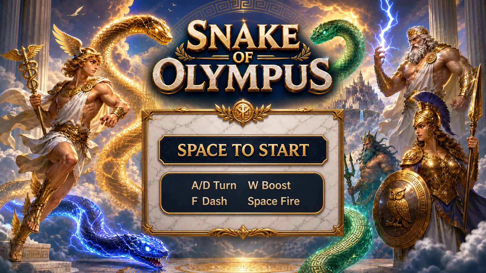
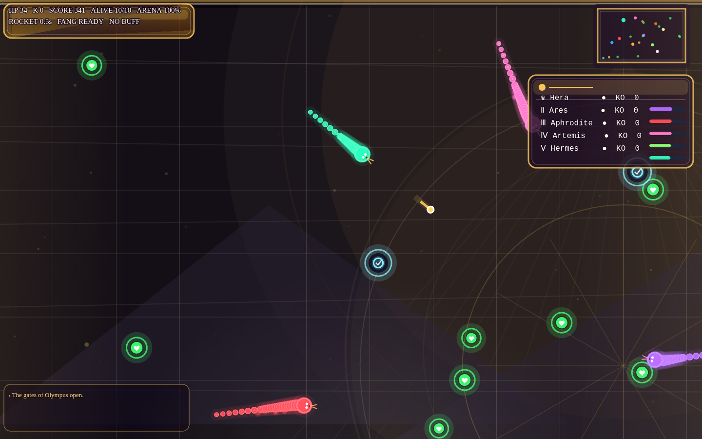
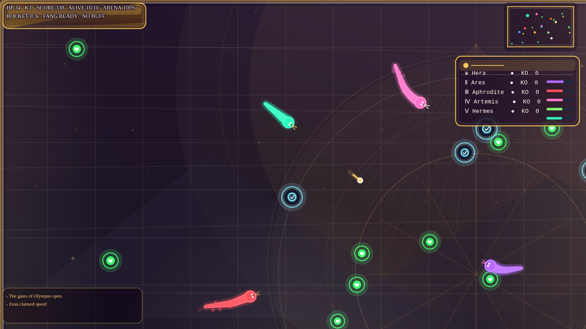

# Snake of Olympus

**Built by Hermes Agent.**

A fast, Olympus-themed browser snake arena game built with Phaser 3, TypeScript, and Vite. Play as Hermes, survive against rival god-snakes, collect fruit and powerups, fire rockets, boost, and charge the Fang Dash while the arena closes in.



## Screenshots

### Gameplay HUD and leaderboard



### Combat



## Features

- 10-snake Olympus roster with Hermes as the player.
- Shrinking arena pressure based on time and alive count.
- Olympus/gold visual theme with star-map backdrop, temple-inspired arena styling, glowing pickups, mines, rockets, particles, and HUD panels.
- Segmented snakes with glow, body tapering, scale plates, head direction, shields, dash aura, and fang details.
- Rockets, boost, Fang Dash, collisions, death drops, and late-game mines.
- Fruit pickups plus speed, triple-shot, and shield buffs.
- AI snakes that pursue fruit, upgrades, and enemies while avoiding walls, mines, and body hazards.
- HUD, leaderboard with KO counts and HP bars, feed, radar/minimap, menu, pause screen, and end screen.
- Background music plus procedural browser SFX with pause-menu volume sliders.
- Local settings and best score persistence.
- Performance optimizations for startup and active play: cached static backdrop, viewport render culling, reduced per-frame allocations, and squared-distance hot paths.
- Vitest gameplay/system tests and Playwright browser smoke test.

## Controls

| Action | Key |
| --- | --- |
| Start / Fire rockets | `Space` |
| Turn left | `A` / `Left` |
| Turn right | `D` / `Right` |
| Boost | `W` / `Up` |
| Charge Fang Dash | Hold `F` |
| Pause / resume | `P` / `Esc` |
| Restart | `R` |
| Mute toggle | `M` |
| Damage numbers toggle | `N` |

Music and SFX volume sliders are available from the pause menu.

## Credits

- Music: `Hades II - Into Tartarus`, credited to Hades II.

## Run locally

```bash
npm install
npm run dev
```

Open:

```text
http://localhost:5173
```

## Build and verify

```bash
npm test
npm run build
npm run test:e2e
```

## Tech stack

- Phaser 3
- TypeScript
- Vite
- Vitest
- Playwright

## Project structure

```text
src/game/
  config/       balance and world constants
  core/         math, RNG, persistence, types
  data/         snake roster
  entities/     snake HP/radius/body helpers
  systems/      arena, audio, radar, scoring, spawn, visuals
  scenes/       Phaser scene orchestration and rendering
```
